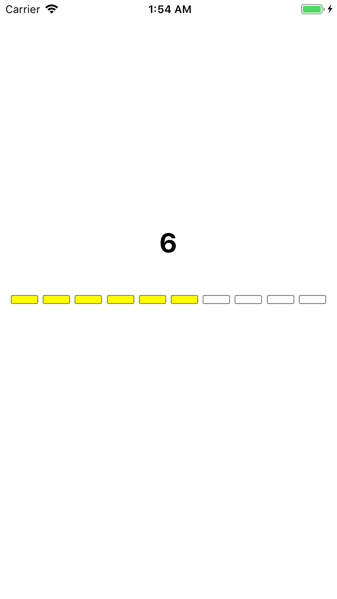

# RatingBar
Adjustable color-coded rating bar

XCODE 10.1, SWIFT 4, Target >11.2

Pan Gesture to enable drag to adjust.  
DidSelect to tap to adjust.

Total Rating Level limited to ten cells.

<li>Cell 0-2: Green</li>
<li>Cell 3-5: Yellow</li>
<li>Cell 6-8: Red</li>
<li>Cell 9: Black</li>
 
<table><tr><td>
  
</td></tr></table>
